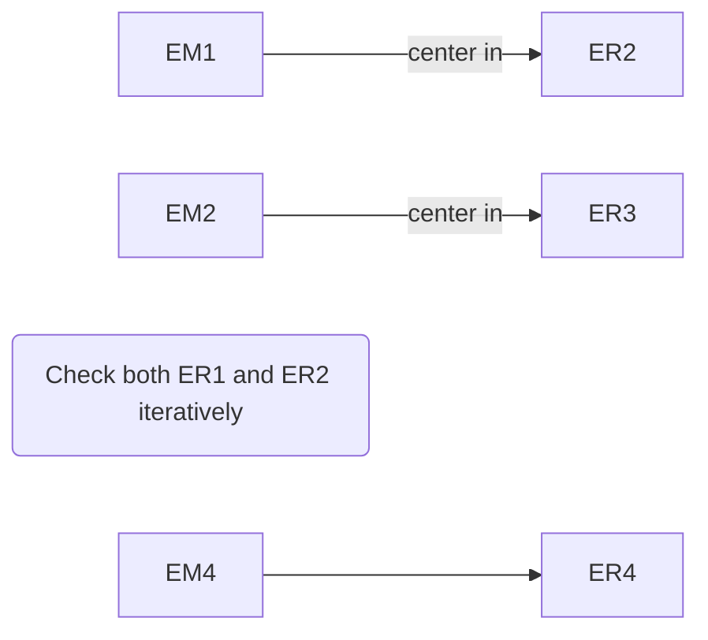
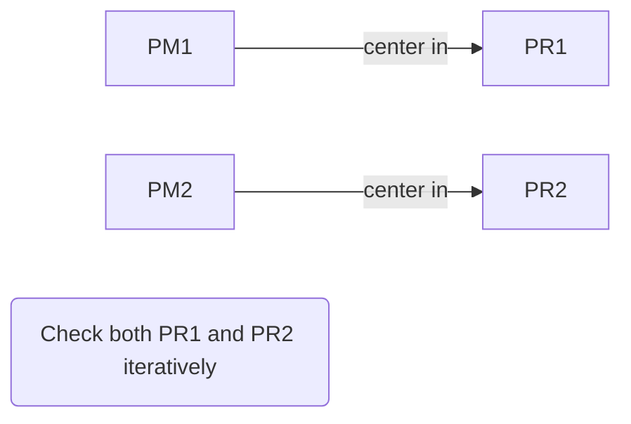
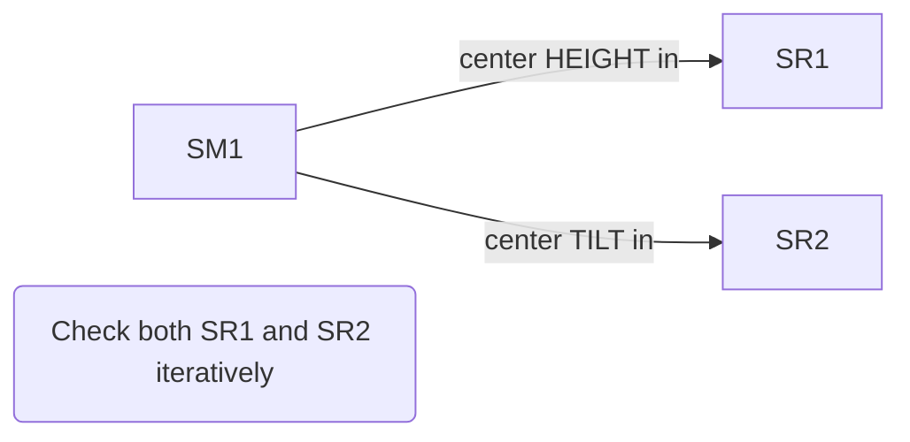
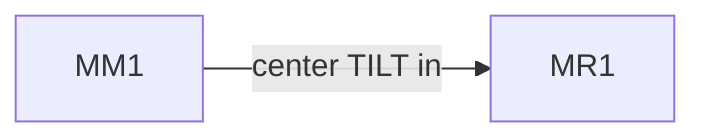
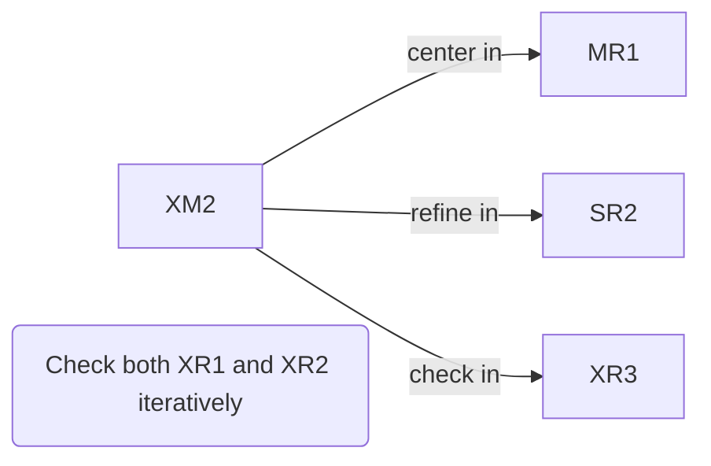
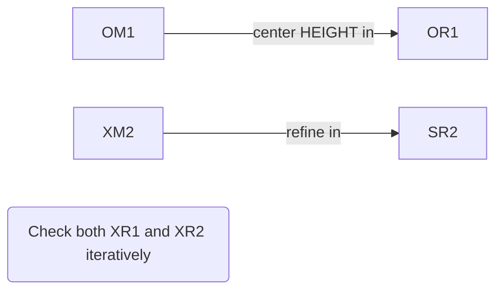

# Timespot WP2 -- Alignment Procedures
In this document we report on the alignment procedure of the optics for the Timespot WP2 project. 

### Contents
[TOC]

## He:Ne calibration system
### Description

A Helium-Neon (He:Ne) laser is used to obtain a preliminary alignment of the system and to study the application of an Space-Light Modulator obtained with Liquid Crystals on Silicon (LCoS SLM) to correct the spherical aberration introduced by the high refractive index of the diamond specimen.

The He:Ne laser source is expanded to a diameter of 5 mm with a Beam Expander (**E**) branch of the optical system. With this branch we aim at injecting in the system a laser beam as similar as possible to the Ti:Sa laser beam to be used for graphitization. The similarities include:
 * Optical axis 
 * Divergence 
 * Beam size

In practice, the beam size is currently much smaller for He:Ne than it will be for Ti:Sa, but this should not prevent its usage to the purpose of alignment and calibration of the SLM mirror.

The beam expander branch is followed by a Periscope (**P**) which allows to move the beam to a higher quote, allowing for more space to allocate the objective and the stage. The alignment of the periscope should be independent of the laser source used, but in principle it could also be helpful to correct small differences in the optical axis between Ti:Sa and He:Ne laser sources that we assume to be negligible in this document. 

After the periscope a Spatial Filter (**F**) is used to clean the beam from higher spatial frequencies and get a beam spot as uniform as possible. 

The filtered beam is projected onto the SLM via a Beam Splitter (**S**) which allows for a perfectly orthogonal reflection of the beam onto the SLM surface.

The Mirror (**M**), which is an alternative name for the LCoS SLM device, modifes the phase of the rays as a function of the position. 

The modified beam is then splitted into two fractions using a second beam splitter, named *The Crossing* (**X**). 

Part of the beam is sent towards The Camera (**C**) while the rest is directed into a 4F system (**4**) which conjugates the SLM surface to the pupil of The Objective (**O**).

The optical system is represented in the Figure. 
Along the optical path, several references obtained with irises are positioned to ease the alignment procedure. 
However, not all of the references represented in Figure are obtained with irises, some of them are removable [targets](https://www.thorlabs.com/newgrouppage9.cfm?objectgroup_id=7296).

In addition to what is represented in the Figure, two light sources to enlight the specimen are available: one _backlight_ obtained with a red LED and a second _frontlight_ obtained with an optical fibers placed on the empty branch of the beam splitter `OM1`. 

### Alignment overview 
The alignment procedure can be summarized in the following subsequent steps:
:::info
1. Remove all the lenses and the objective
2. Align the optical axis 
3. Mount the beam expander
4. Mount and align the camera
5. Mount and align the objective
6. Mount and align the 4F
7. Refine the alignment of the SLM
8. Mount and align the Filter 
:::
It is important to follow this order and not to modify the configuration of the mirrors after step 2, since none of the other operations has the potential to alter the optical path. 

### Define the Optical axis
For the aligmnent of the optical axis, the mirror CM1 has to be remove and a reflective specimen (for example a diamond) should be used instead.
#### Expander branch

#### Periscope

#### The Splitter

#### The Mirror

#### The Crossing

##### The Objective branch

At this point the CAMERA should show two laser spots: one from XM2 and one from the reflection of the sample on the stage. 
If this is not the case, it is possible that the tilt of OM1 is completely off or that something went wrong in the above procedure. 
If both the spots are visible, cover XM1 with a beam stopper to ensure only the spot from the specimen is visible on the camera.
Now, moving the stage upside and downside the reflected spot on the camera must remain in the same position of the screen. 
Tune the tilt of OM2 to ensure this is the case. 

### Mount the Beam Expander
The purpose of the beam expander is to obtain a perfectly collimated beam with an ideal diameter of 10 mm, in practice due to constraints with the available optics, the current beam diameter is around 6 mm. 

:::warning
**Important notice:** The beam obtained from the He:Ne laser source is **not** perfectly collimated and has a non null divergence as it can be easily verified by projecting it towards infinite with a movable mirror. 
The alignment strategy should therefore avoid relying on such a feature of the He:Ne laser source. 
:::

Both of the lenses composing the Beam Expander can be regulated on the transversal plane ($x\perp y$), while only the second one (EL2) can be finely regulated along the beam axis ($z$). 

The suggested strategy to install the beam expander follows: 
1. Check that ER1 is perfectly centered on the beam axis, or regulate it finely to obtain an excellent reference for the beam position;
2. Mount EL1 and regulate its transversal position to ensure the focus is still centered in ER1. Note that since the focal distance of EL1 is very short, checking the alignment on ER2 would be very unpractical, and ER1 has been installed on purpose;
3. Mount EL2 and ensure the beam is still centered in ER2;
4. Install the mirror EM4 to project the expanded beam  onto a wall of the lab as distant as possible;
5. Close the iris ER2;
6. Tune the position of EL2 along the $z$ axis to minimize the spot size on the lab wall;
7. Open the iris and verify that the borders of the projected slot are relatively sharp and the size is the same the iris diameter;
8. Ensure that ER1 and ER2 are completely open before moving on;
9. Dismantle EM4 before moving on.

### Install the lens in front of the camera
The successive steps of the alignment will rely on the assumption that the camera is focussed at $+\infty$. This is a crucial requirement for the alignment of both the 4F system and the spatial filter.
A first, coarse regulation of the $z$-position of CL1 can be achieved relying on the collimation of the beam described in the section devoted to the installation of the Beam Expander. 

Nonetheless, for a fine adjustment of the focus we recommend to:
1. Install a 45°-tilted mirror on top of the sample, on the stage;
2. Rotate it around the vertical axis to project the laser beam on a wall;
3. Place a bright LED (for example using a smartphone) where the laser beam hits the wall;
4. Switch off the laser beam;
5. Tune the $z$ position of CL1 in order to minimize the size of the LED image on the camera. 
6. Remove the tilted mirror before moving on

### Install the objective
The installation of the objective does not seem to imply difficulties. Once the objective is installed, be sure to define the distance between the objective and the diamond specimen using a graphitized diamond specimen and projecting its image on the camera (while moving only the motor). 

### Install the 4F system 
The 4F is necessary to project the image of the mirror on the pupil of the objective. In principle the rays impinging on the outer pixels (in y) of the mirror should hit the border of the pupil. The 4F system is designed to ensure the correct magnification, but a careful alignment procedure is necessary. 

The following alignment procedure has been identified:
1. Install **4L2**
2. Tune the $xy$ position of 4L2 by ensuring that the focus is centered in XR2 
3. Switch off laser and backlight and switch on the frontlight
4. Tune the $z$ position of 4L2 to focus on the camera the image of the pupil of the objective (some powder)
5. Note that several focal plane are reachable by fine adjustments of the 4L2 lens, the pupil is the *most upstream* whose image that rotates together with the objective (just begin to unscrew it)
6. Switch off the frontlight and switch on the laser
7. Install 4R1 and ensure it is centered on the beam axis
8. Install **4L1** 
9. Tune its $xy$ position first, by centering the focus in 4R1
10. Switch on the backlight
11. Tune its $z$ position by focusing the image of the sample onto the camera (**ignore the laser focus**!)
12. Remove 4R1 and esure XR1 and XR2 are completely open

### Install the Spatial Filter
The spatial filter is the last element to install because it weakens significantly the laser intensity and therefore may make the other alignment operations a bit more difficult. 
The aim of the spatial filter is twofold, on one hand it is necessary to clean the higher spatial frequencies introduced in the laser beam from the upstream optics by presenting a uniform wavefront to the SLM, on the other hand it allows for a fine tuning of the beam divergence that can be used to ensure that the laser focus is perfectly aligned with focal plane of the camera. Note that the second purpose is not relevant for the He:Ne setup, where a tunable beam expander may serve to the same purpose, but is mandatory for the Ti:Sa setup, sharing this branch of the optical system.

The procedure identified to install the spatial filter is as follows:
1. Install FL2;
2. Tune $xy$ to ensure the focus is in PR2, ignore $z$  at this level;
3. Install FR1, a coarse target not the pin-hole;
4. Install FL1 and tune $xy$ on FR1;
5. Remove FR1;
6. Install FR2 (the pin hole);
7. Tune $z$ to focus on the pin hole, approximate the ideal position staying slightly upstream with respect to the ideal position;
8. Iteratively, maximize the intensity of the light passing through the pin hole and move downstream the $z$ of the lens. At the end of the procedure, the smallest possible modification of the $xy$ position of FR2 (pinhole) makes the light transmission to disappear. At its maximum, the laser light is well visible also with the lab neon lamps switched on;
9. Tune the $z$ position of the lens to focus on the same plane of surface of the diamond which is projected on the camera. 

### Fine tuning of the SLM position
It is mandatory that the origin of the coordinate system of the SLM mirror is perfectly aligned with the optical axis. Indeed, if this condition is not respected, the radial correction set through the SLM would include a phi-dependend component that may result into unpredicted behaviour of the focussed wave front. 

To regulate the $xy$ position of the mirror, modify the $Z_2^0$ coefficient to define a concentrical figure on the mirror. An image of the mirror phase shift is formed after 4L1, upstream of the focus position.

The SLM position can be adjusted while iteratively closing the iris XR1 to preserve the circular symmetry. 

The $z$ position of the SLM can be regulated by defining a phase shift with a computer-generated holography and focussing the resulting image as reflected by the diamond surface. The $z$ position of the mirror, however, does not seem to be critical and can be set relatively quickly. 

### Software calibration of the SLM
After the alignment of the optics, some tuning of software-controlled parameters of the mirror is necessary.

#### Define the phase wrap $\phi_{\mathrm{wrap}}$
The phase wrap $\phi_{\mathrm{wrap}}$ is the level of gray of the image loaded as a phase distribution on the SLM that is equivalent to a complete phase tour of $2\pi$. This quantity is expected to change significantly with the laser wavelength. 

To define the value for $\phi_{\mathrm{wrap}}$, enable the checkbox "**Calibration chess board**" in the *General Settings* panel of the mirror controller and then regulate the value of `phi wrap` in the *Spherical aberration correction* panel to obtain on the camera the same single spot as the one obtained with a flat mirror. 

#### Compute the effective numerical aperture (ENA)
The Numerical Aperture of the objective is a construction parameter that should not need to be calibrated. However the computation of the Numerical Aperture from the constructor assumes that the pupil of the objective is perfectly conjugated to the SLM active area. If the image of the mirror on the pupil is larger than the pupil, the Effective Numerical Aperture (ENA) relevant to the mirror configuration will be larger than the nominal NA. In contrast, if the image of the SLM on the pupil is smaller than the pupil, then the ENA is smaller then the nominal NA. 

To measure the ENA one can compensate the effect of a defocus obtained with a shift of the sample with a defocus imposed with the mirror and choose the value for the ENA that makes the two distances to match.
Note that the defocus is computed for a material with refractive index $n_2$ (usually the diamond) but for this calibration the defocussing is relevant to the material before the diamond surface, used as a mirror. Therefore for this calibration, one has to set $n_2 = n_1$ (where $n_1$ is refractive index of air or oil depending on the configuration.)

:::warning
Note that the depth difference obtained with the mirror has to be a **factor 2 larger** than the displacement of the diamond surface because the new focus is a virtual focus. 

The figure reported below should help understanding why the factor two is needed. 

:::

## Conclusion 
This document defines a strategy to align the optical system used for graphitization, extended to the He:Ne beam expansion branch. 

Part of the optical system has been designed to ease the alignment procedure that should take a couple of hours from the beginning to the end. 

The online version of this document, available at https://codimd.web.cern.ch/s/ry38DpiT8 will be updated  as improvements to the procedure will be identified. 

